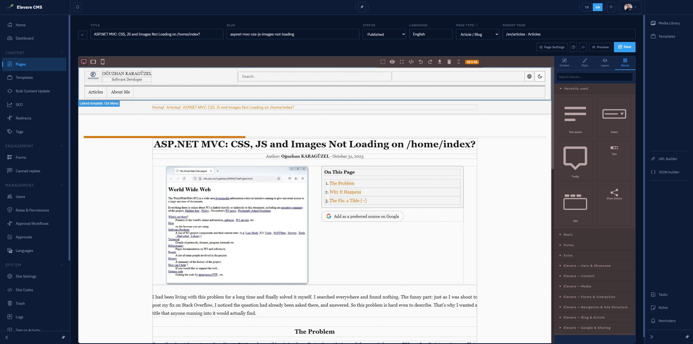
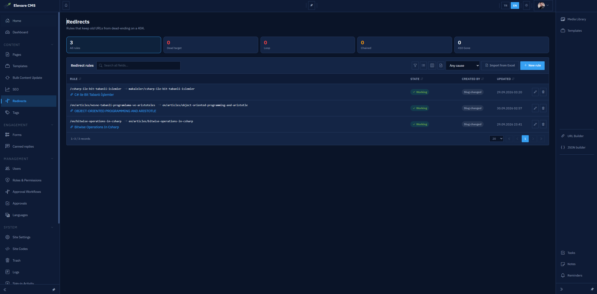
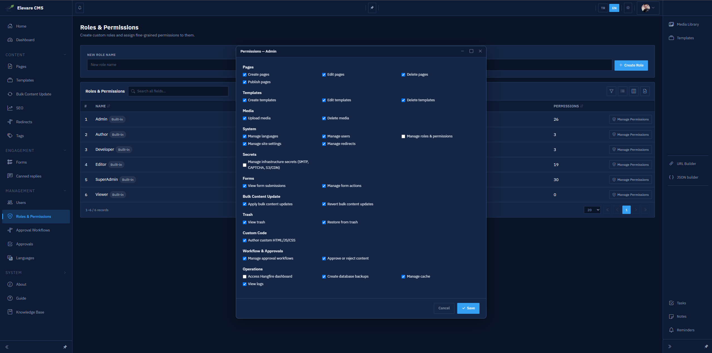
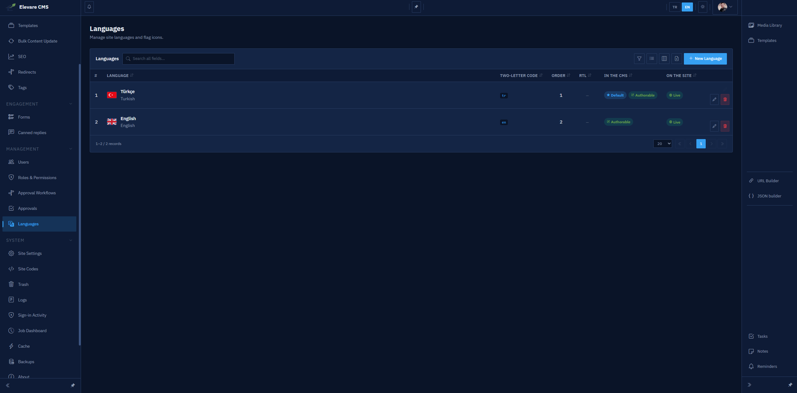
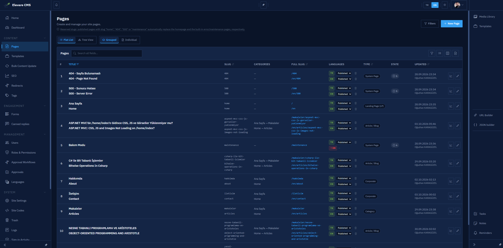
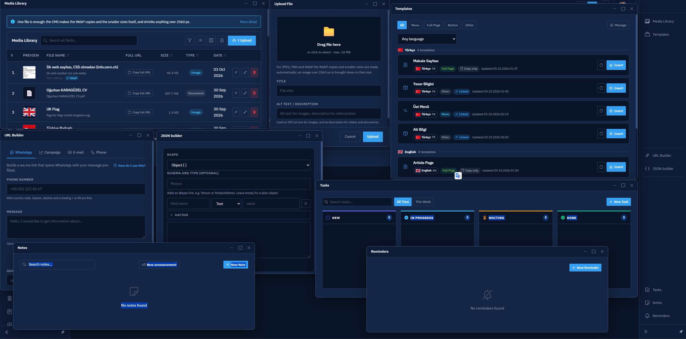

# Elevare

[English](README.md) · **Türkçe**

[](https://github.com/Oguzhankaraguzel/elevare/actions/workflows/ci.yml)
[](LICENSE)
[](https://dotnet.microsoft.com/)

Elevare, .NET 9 ile yazılmış bir içerik yönetim sistemi (CMS) ve bu sistemin
yayınladığı web sitesidir.

Proje iki ayrı uygulamadan oluşur:

- **CMS:** Blazor Server ile yazılmış yönetim paneli. Sayfalar GrapesJS ile
  sürükle-bırak yöntemiyle hazırlanır. Onay akışları, rol tabanlı yetkiler, çok
  dilli içerik ve zamanlanmış görevler de burada yönetilir.
- **Site:** ASP.NET Core MVC uygulaması. CMS'te yayınlanan içeriği ziyaretçilere
  sunar.

İki uygulama aynı PostgreSQL veritabanını paylaşır. Kural basittir: **tabloları CMS
oluşturur ve veriyi CMS yazar; site yalnızca okur.**

```
├── src
│   ├── SharedKernel      # İki uygulamanın ortak kodu
│   ├── cms               # CMS (Core, Infrastructure, Presentation)
│   └── web               # Site (Core, Infrastructure, Presentation)
├── tests
│   ├── cms               # CMS testleri
│   └── web               # Site testleri
└── Elevare.sln
```

## Özellikler

- **Görsel sayfa tasarımı.** Sayfaları GrapesJS bloklarını sürükleyip bırakarak
  hazırlarsınız. Sık kullandığınız parçaları şablon olarak saklayabilir, sayfayı
  yayınlamadan önce başkalarıyla önizleme linki paylaşabilirsiniz.
- **Onay akışları.** Adımları ve her adımda kimin onay vereceğini siz belirlersiniz.
  Değişiklik karşılaştırması HTML'e değil, okurun gördüğü metne göre yapılır.
  GrapesJS her kayıtta HTML'i yeniden yazdığı için aksi hâlde aslında değişmemiş
  yerler de değişmiş görünürdü.
- **Rol tabanlı yetkiler.** Yetkiler panelden değiştirilebilir ve her istekte
  sunucuda denetlenir. Bir işlemi engelleyen şey yalnızca butonun gizlenmesi değildir.
- **Çok dilli içerik.** Her dilin kendi adres öneki (`/en/...`) ve kendi yayın
  ayarı vardır. Hangi sayfanın hangi dile çevrildiği Sayfalar ekranında tek bir
  tabloda görünür.
- **SEO araçları.** Sayfa bazında meta etiketleri ve yapısal veri, panelden
  düzenlenebilen `robots.txt` ve `llms.txt`, otomatik oluşturulan site haritası.
  Yönlendirmeler ekranı ölü hedefleri ve döngüleri kendiliğinden tespit eder.
- **Sosyal medya paylaşımı.** Her sayfa için Open Graph etiketlerinin tamamı (tüm
  `og:type` türleri ve bunlara özel alanlar; görsel, video ve ses ayrıntıları; dil)
  ve X'in dört kart türü. Paylaşım kartının nasıl görüneceği editörde önizlenir.
- **Hafif görseller.** Yüklenen her görselin bir ana kopyası saklanır (en fazla
  2560 px, yönü düzeltilmiş, %90 kalitede JPEG). Bunun yanında WebP sürümü ve
  küçültülmüş kopyalar üretilir. Site bunları `<picture>` ve `srcset` ile sunar;
  `sizes` değerini sayfanın kendi CSS'inden hesaplar. Tek bir görselden bütün
  favicon boyutları üretilir. Editördeki genişlik/yükseklik alanı görselin oranını
  korur, SEO kontrolü de yanlış oranla gösterilen görselleri yakalar.
- **Formlar.** Gelen yanıtlar panelde listelenir. Hazır cevap şablonları, spam
  koruması ve dosya eki desteği vardır (en fazla üç dosya ve 10 MB; içeriği
  incelenerek kabul edilen beş dosya türü). Ekler herkese açık değildir, yalnızca
  yetkisi olan kullanıcılar indirebilir.
- **Etiket yönetimi.** Her etiketin kaç yerde kullanıldığı görünür. Yazım hatasıyla
  oluşmuş bir etiketi fark edip silebilirsiniz; listede sonsuza kadar kalmaz.
- **Operasyon araçları.** Zamanlanmış yedekleme, eski verilerin temizlenmesi, görev
  takip ekranı, önbellek yönetimi ve kimin neyi sildiğini kaydeden bir Çöp Kutusu.

## Ekran görüntüleri

Sayfa editörü: sürükle-bırak bloklar, anlık SEO puanı ve yayından önce
paylaşılabilen önizleme linki.



Yönlendirmeler ekranı sorunları en başta gösterir: ölü hedefler, döngüler, art arda
zincirlenmiş yönlendirmeler. Bozuk bir yönlendirme normalde ancak bir ziyaretçi 404
sayfasına düştüğünde fark edilir.



Yetkiler rol bazında tanımlanır ve panelden değiştirilebilir. Denetim butonları
gizleyerek değil, sunucuda yapılır.



Her dilin iki ayrı anahtarı vardır: CMS'te o dilde içerik yazılabilir mi, o dil
sitede yayında mı. Böylece yarım kalmış bir çeviri dışarı sızmaz, tamamlanmış bir
çeviri de yanlışlıkla gizli kalmaz.



Sayfalar listesi aynı zamanda bir çeviri tablosudur. İçerik yazılabilen ama henüz
yayında olmayan diller işaretlenir. "Yayında" görünüp aslında açılmayan bir sayfa
varsa, onu zaten bakacağınız ekranda fark edersiniz.



Editörde "bunu nereden değiştiririm?" sorusunun cevabı hep aynıdır. Sağda tek bir
sütun ve dört sekme bulunur: seçili öğenin içeriği için **İçerik**, görünüşü için
**Görünüm**, ardından **Katmanlar** ve **Bloklar**. Sayfanın kendisiyle ilgili her
şey (SEO, sosyal medya kartları, yapısal veri, etiketler, diller, site kodları)
tek bir **Sayfa Ayarları** panelinde toplanır. Medya kütüphanesi, görev panosu,
notlar ve hatırlatıcılar, WhatsApp ve kampanya linki oluşturucu, JSON-LD
oluşturucu gibi yardımcı araçlar yüzen pencerelerde açılır; bunları istediğiniz
yere taşıyabilirsiniz. Hiçbiri üzerinde çalıştığınız sayfayı kapatmaz.



Belgeler: [Mimari](docs/ARCHITECTURE.tr.md) ·
[Katkıda bulunma](CONTRIBUTING.tr.md) · [Güvenlik](SECURITY.tr.md) ·
[Değişiklik geçmişi](CHANGELOG.md) (İngilizce)

Projeyi üç şekilde çalıştırabilirsiniz: **Docker** (en hızlısı), mevcut bir
PostgreSQL ile `dotnet run` ya da IIS'e klasör olarak yayınlama. Size uygun olanı
seçin.

---

## Yöntem A: Docker

Docker Desktop (ya da Docker Engine ve Compose v2) yeterlidir. .NET SDK veya
PostgreSQL kurmanıza gerek yoktur.

```bash
cp .env.example .env
```

`.env` dosyasını açıp boş alanları doldurun. Alanlardan biri bile boş kalırsa
sistem başlamaz. Bu kasıtlıdır; hiçbir kurulumun varsayılan bir şifreyle
çalışmaya başlamaması için böyle tasarlandı.

| Değişken | Açıklama |
| --- | --- |
| `POSTGRES_PASSWORD` | `POSTGRES_USER` ile belirtilen PostgreSQL kullanıcısının şifresi. |
| `JWT_SECRET` | Yönetici oturumlarını imzalar. **En az 32 karakter** olmalıdır; daha kısaysa CMS açılırken hata verir. |
| `PREVIEW_SIGNING_KEY` | Yayınlanmamış sayfaların önizleme linklerini imzalar. CMS'te ve sitede **aynı** olmalıdır, aksi hâlde önizleme linkleri çalışmaz. |
| `CACHE_CLEAR_SECRET` | CMS'in siteye gönderdiği "önbelleği temizle" isteklerini doğrular. İki uygulamada da aynı olmalıdır. Boş bırakılırsa site bütün temizleme isteklerini 401 ile reddeder. |
| `ADMIN_EMAIL`, `ADMIN_PASSWORD` | İlk yönetici hesabı. Veritabanı boşken yapılan ilk açılışta oluşturulur. |
| `ADMIN_USERNAME` | Belirtilmezse `superadmin` kullanılır. |

Anahtarları elinizdeki araçlardan biriyle üretebilirsiniz:

```bash
openssl rand -base64 48
```

```powershell
[Convert]::ToBase64String((1..48 | ForEach-Object { Get-Random -Maximum 256 }))
```

Ardından:

```bash
docker compose up -d --build
```

İlk derleme birkaç dakika sürer. Tamamlandığında:

| | Adres |
| --- | --- |
| CMS (yönetim paneli) | <http://localhost:5150> |
| Site | <http://localhost:5160> |

Portları `.env` dosyasından değiştirebilirsiniz (`CMS_PORT`, `WEB_PORT`, `DB_PORT`,
`REDIS_PORT`).

İşinize yarayacak komutlar:

```bash
docker compose logs -f cms
```

```bash
docker compose down
```

```bash
docker compose down -v
```

`down` her şeyi durdurur ama verilere dokunmaz. `down -v` ise volume'leri de siler;
veritabanı, yüklenen medya, yedekler ve şifreleme anahtarları gider. Gerçekten
sıfırdan bir kurulum istediğinizde bunu kullanın.

### Compose neleri başlatır

- **db:** PostgreSQL 15 (Alpine). Uygulamalar veritabanı hazır olana kadar bekler,
  bu yüzden `up` komutunda başlama sırası sorun çıkarmaz.
- **cache:** Redis. Zorunlu değildir; önbellek türü CMS'te Site Ayarları'ndan
  seçilir ve site Redis olmadan da sorunsuz çalışır. Compose'a eklenmesinin sebebi,
  Redis'e geçişi ayrı bir sunucu kurma işi olmaktan çıkarıp bir ayar değişikliğine
  indirmektir.
- **cms:** Açılışta tabloları oluşturur ve başlangıç verilerini ekler, ardından
  yönetim panelini sunar.
- **web:** Site.

Volume'ler: `db-data`, `db-backups`, `cms-uploads`, `cms-keys`. `db-backups` bilerek
`db-data`'dan ayrı tutulur (bkz. [Ayarlar](#ayarlar)) ve yalnızca `cms`
konteynerine bağlanır. Bunun sebebi, PostgreSQL'de SQL Server'daki gibi
veritabanının içinden yedek alan bir komut olmamasıdır: yedeği
`DatabaseBackupService`, CMS konteynerinin içinden `pg_dump` çalıştırarak alır.

### Geliştirme araçları (isteğe bağlı)

`docker-compose.dev-tools.yml`, normalde gerçek bir dış servis gerektiren iki iş
için iki konteyner ekler. **Yalnızca geliştirme ortamı içindir.** Başka bir ortama
göre yapılandırılmamışlardır; Seq bilerek kimlik doğrulama olmadan çalışır.

```bash
docker compose -f docker-compose.yml -f docker-compose.dev-tools.yml up -d
```

| | Ne işe yarar | Adres |
| --- | --- | --- |
| **Mailpit** | CMS'in gönderdiği bütün e-postaları yakalar. SMTP ayarlarını ve Site Ayarları'ndaki gönderen adresini gerçek bir posta kutusu olmadan deneyebilirsiniz. | <http://localhost:8025> |
| **Seq** | İki uygulamanın loglarını tek bir yerde toplar ve alanlara göre arama yapmanızı sağlar. Örnek: `Application = 'Elevare.Web' and RequestPath like '/urun%'`. Her kayıtta `Application` alanı bulunduğu için iki uygulamanın logları birbirine karışmaz. | <http://localhost:5341> |

Portlar `.env` dosyasındaki `MAILPIT_UI_PORT` ve `SEQ_UI_PORT` değişkenleriyle
ayarlanır. Seq kayıtlarını `seq-data` volume'ünde tuttuğu için yeniden derleme
yaptığınızda incelediğiniz loglar silinmez. Ek dosyayı vermeden başlatırsanız
(`docker compose up -d`) bu iki konteyner durur ve iki uygulama da loglarını
yalnızca konsola yazar.

---

## Yöntem B: Docker olmadan

[.NET 9 SDK](https://dotnet.microsoft.com/download) ve erişebildiğiniz bir PostgreSQL
sunucusu gerekir (bilgisayarınızda kurulu, Docker'da çalışan ya da uzak bir sunucu
olabilir).

**1. Uygulamaları veritabanına bağlayın.** İki `appsettings.json` dosyasında da şu
bağlantı bilgisi yazılıdır:

```
Host=localhost;Port=5432;Database=ElevareDB;Username=postgres;Password=postgres
```

Varsayılan ayarlarla kurulmuş yerel bir PostgreSQL'de olduğu gibi çalışır. Sizin
kurulumunuz farklıysa değiştirin; nasıl yapılacağı aşağıdaki [Ayarlar](#ayarlar)
bölümünde anlatılıyor.

**2. Gizli değerleri girin.** En azından şunlar gerekir: `Jwt:SecretKey` (en az 32
karakter), `Preview:SigningKey` ve `Cache:ClearSecret` (ikisi de her iki uygulamada
aynı olmalı) ve ilk yönetici hesabının bilgileri.

En kolay yol, uygulamaların yanındaki örnek dosyaları kopyalamaktır:

```bash
cp src/cms/Presentation/Wasm/Wasm/appsettings.Development.json.example src/cms/Presentation/Wasm/Wasm/appsettings.Development.json
```

```bash
cp src/web/Presentation/WebMvc/appsettings.Development.json.example src/web/Presentation/WebMvc/appsettings.Development.json
```

Bu kopyalar git'e eklenmez; içlerine yazdıklarınız yalnızca sizin bilgisayarınızda
kalır. Gizli değerlerin hiçbir dosyada durmasını istemiyorsanız aynı işi
`dotnet user-secrets` ile de yapabilirsiniz:

```bash
dotnet user-secrets --project src/cms/Presentation/Wasm/Wasm set "Jwt:SecretKey" "<en az 32 karakter>"
```

```bash
dotnet user-secrets --project src/cms/Presentation/Wasm/Wasm set "Seed:SuperAdmin:UserName" "superadmin"
```

```bash
dotnet user-secrets --project src/cms/Presentation/Wasm/Wasm set "Seed:SuperAdmin:Email" "siz@example.com"
```

```bash
dotnet user-secrets --project src/cms/Presentation/Wasm/Wasm set "Seed:SuperAdmin:Password" "<şifreniz>"
```

```bash
dotnet user-secrets --project src/web/Presentation/WebMvc set "Preview:SigningKey" "<CMS'tekiyle aynı değer>"
```

**3. Çalıştırın.** CMS açılırken veritabanını kendisi oluşturur ve migration'ları
uygular; ayrıca bir migration komutu çalıştırmanız gerekmez.

```bash
dotnet run --project src/cms/Presentation/Wasm/Wasm/Wasm.csproj --launch-profile "CMS (https)"
```

```bash
dotnet run --project src/web/Presentation/WebMvc/WebMvc.csproj --launch-profile "Web (https)"
```

Visual Studio'da **Elevare (CMS + Web)** profili iki uygulamayı birlikte başlatır.

| Uygulama | HTTPS | HTTP |
| --- | --- | --- |
| CMS (yönetim paneli) | `https://localhost:7150` | `http://localhost:5150` |
| Site | `https://localhost:7160` | `http://localhost:5160` |

### "Address already in use" hatası

Düzgün durdurulmayıp zorla kapatılan bir debug oturumu portu bırakmaz. Şu komutla
kapatabilirsiniz:

```powershell
Get-Process Wasm,WebMvc -ErrorAction SilentlyContinue | Stop-Process -Force
```

---

## Yöntem C: IIS'e klasör olarak yayınlama

Bu yöntemde ne Docker ne de `dotnet run` kullanılır: her uygulamayı bir klasöre
yayınlarsınız, IIS de onları çalıştırır. Projeler kendi `web.config` dosyalarını
ürettiği için IIS'in onları tanıması için ek bir ayar gerekmez.

```bash
dotnet publish src/cms/Presentation/Wasm/Wasm/Wasm.csproj -c Release -o C:\inetpub\elevare-cms
```

```bash
dotnet publish src/web/Presentation/WebMvc/WebMvc.csproj -c Release -o C:\inetpub\elevare-web
```

Sunucuda [.NET 9 Hosting Bundle](https://dotnet.microsoft.com/download/dotnet/9.0)
kurulu olmalıdır. Yalnızca runtime yetmez; IIS'in ihtiyaç duyduğu ASP.NET Core
Module bu paketle birlikte gelir.

`appsettings.Development.json` yayın çıktısına bilerek dahil edilmez. Böylece yerel
bağlantı bilgileriniz, imza anahtarlarınız ve ilk yönetici şifreniz sunucuya
taşınmaz.

### Ayarların verilmesi

[Ayarlar](#ayarlar) bölümündeki her şey bu yöntem için de geçerlidir. Ayarları
uygulama havuzunda ortam değişkeni olarak ya da `web.config` içinde verebilirsiniz:

```xml
<aspNetCore processPath="dotnet" arguments=".\Wasm.dll" hostingModel="inprocess">
  <environmentVariables>
    <environmentVariable name="ASPNETCORE_ENVIRONMENT" value="Production" />
    <environmentVariable name="ConnectionStrings__DefaultConnection" value="Host=localhost;Port=5432;Database=ElevareDB;Username=elevare;Password=..." />
    <environmentVariable name="Jwt__SecretKey" value="..." />
    <environmentVariable name="Preview__SigningKey" value="..." />
    <environmentVariable name="Cache__ClearSecret" value="..." />
    <environmentVariable name="DataProtection__KeyPath" value="C:\inetpub\elevare-keys" />
  </environmentVariables>
</aspNetCore>
```

PostgreSQL, SQL Server'daki `Trusted_Connection` gibi Windows kimliğiyle oturum
açmaz; bağlantı bilgisindeki kullanıcı adı ve şifreyi kullanır. Bu yüzden
yukarıdaki kullanıcının veritabanında kendi hesabı ve yetkileri olmalıdır.

### Atlanırsa sorun çıkaracak üç ayar

**`DataProtection:KeyPath` ayarını mutlaka verin.** Verilmezse şifreleme anahtarları
kullanıcı profiline yazılır. Kullanıcı profili yüklemeyen bir uygulama havuzunda
ise anahtarlar yalnızca bellekte tutulur. Bu durumda uygulama havuzu her yeniden
başladığında bütün yöneticilerin oturumu kapanır, açık sayfalardaki formların
güvenlik doğrulaması da geçersiz hâle gelir. Bu ayarı, uygulama havuzunun yazma
izni olan bir klasöre yönlendirin.

**Uygulama havuzunu sürekli çalışacak şekilde ayarlayın, yoksa zamanlanmış görevler
durur.** Hangfire, CMS'in içinde çalışır. IIS varsayılan olarak 20 dakika boyunca
istek almayan uygulamayı kapatır. Biri paneli tekrar açana kadar site haritası
üretilmez, hatırlatıcılar gönderilmez, yedek alınmaz, eski veriler temizlenmez.
Uygulama havuzunun Gelişmiş Ayarlar'ında **Start Mode** değerini `AlwaysRunning`,
**Idle Time-out** değerini `0` yapın. Ardından IIS'in *Application Initialization*
özelliğini etkinleştirin ve sitede `preloadEnabled="true"` ayarını verin.

**Uygulama havuzu kimliğine yazma izni verin.** İzin gereken klasörler: CMS'in
`wwwroot\uploads` klasörü, `DataProtection:KeyPath` ile belirttiğiniz klasör ve
`Backup:Directory` (boşsa uygulama klasörünün altındaki varsayılan konum).
PostgreSQL'de SQL Server'daki `BACKUP DATABASE` gibi bir komut yoktur;
`DatabaseBackupService` yedekleri uygulamanın içinden `pg_dump` ve `pg_restore`
çalıştırarak alır. Dolayısıyla `postgresql-client` araçlarının PATH'te bulunması
ve o klasöre yazabilmesi gereken hesap, veritabanı servis hesabı değil, **uygulama
havuzu kimliğidir**.

`Backup:Directory` boş bırakılırsa yedekler uygulamanın yanındaki bir klasöre
yazılır. Deneme için bu yeterlidir, ancak gerçek bir kurulumda yedekleri
PostgreSQL verisinin bulunduğu diskten farklı bir diske (ya da bir ağ paylaşımına)
yönlendirin. Aksi hâlde tek bir disk arızasında hem veritabanını hem de bütün
yedeklerini aynı anda kaybedersiniz.

### Bilinen kısıtlama

Her uygulama **kendi sitesinin kök dizininde** çalışacak şekilde tasarlanmıştır.
CMS'i bir alt dizinde (`https://example.com/cms`) yayınlamak işe yaramaz: linkleri
kökten başladığı için alan adının köküne gider. Her uygulama için ayrı bir site ya
da alt alan adı kullanın.

---

## Her push'ta otomatik yayın

`master` dalına yapılan her push sistemi otomatik olarak yayına alabilir.
`.github/workflows/ci.yml` önce testlerin, güvenlik açığı taramasının ve iki imajın
derlenmesinin başarılı olmasını bekler. Ardından sunucuya bağlanır ve sizin elle
yazacağınız komutların aynısını çalıştırır:

```bash
git fetch origin master
git reset --hard origin/master
docker compose up -d --build
docker image prune -f
```

Bu adım siz etkinleştirene kadar kapalıdır. Böylece projeyi fork'layan biri var
olmayan bir sunucuya bağlanmaya çalışmaz. *Settings → Secrets and variables →
Actions* altına iki **değişken** ekleyin: değeri `true` olan `DEPLOY_ENABLED` ve
sunucudaki proje klasörünü gösteren `DEPLOY_PATH`. Bunlara ek olarak dört **gizli
değer** (secret) tanımlayın:

| Ad | Açıklama |
| --- | --- |
| `DEPLOY_HOST` | Sunucunun adresi ya da IP'si. |
| `DEPLOY_USER` | SSH kullanıcısı. `docker` grubunda olmalı ve proje klasörünün sahibi olmalıdır. |
| `DEPLOY_SSH_KEY` | Açık anahtarı bu kullanıcının `~/.ssh/authorized_keys` dosyasında bulunan özel anahtar. Kendi kişisel anahtarınızı kullanmayın, bu iş için yeni bir anahtar üretin. |
| `DEPLOY_PORT` | SSH portu. |

İlk çalıştırmadan önce bilmeniz gereken iki şey var:

- **`git reset --hard`, sunucuda yapılmış değişiklikleri siler.** Bu, git'in takip
  ettiği bütün dosyalar için geçerlidir. `.env` takip edilmediği için korunur;
  ancak sunucuda elle düzenlediğiniz bir ayar dosyası korunmaz.
- **İmajlar sunucuda derlenir.** Her yayın sunucunun işlemcisini birkaç dakika
  meşgul eder; bu sürenin büyük kısmı CMS'in Blazor WebAssembly tarafına harcanır.
  Bu bir sorun hâline gelirse çözüm, imajları CI'da derleyip sunucunun hazır imajı
  indirmesini sağlamaktır. Bu daha kapsamlı bir değişiklik olduğu için derleme
  süresi gerçekten can sıkana kadar gerek yoktur.

---

## İlk açılış

Hangi yöntemi seçmiş olursanız olun, boş bir veritabanıyla yapılan ilk açılışta
şunlar olur:

1. Veritabanı oluşturulur ve tek migration (`InitialCreate`) uygulanır.
2. Roller eklenir: SuperAdmin, Admin, Editor, Author, Viewer, Developer.
3. Yönetici hesabı oluşturulur, **ancak yalnızca** `Seed:SuperAdmin:UserName`,
   `Email` ve `Password` değerlerinin üçü de verilmişse. Biri bile eksikse hiçbir
   hesap oluşturulmaz. Bu kasıtlıdır: bir yazım hatası yüzünden sizin seçmediğiniz
   bir şifreyle hesap açılmasının önüne geçer.
4. İki dil, site ayarları listesi, bakım sayfası ve üç hazır form cevap şablonu
   eklenir.

Yönetici bilgileri verilmemişse ve kullanıcı tablosu boşsa CMS açılırken bunu
belirten bir hata kaydı yazar. Üç değeri girip uygulamayı yeniden başlatın.

**Giriş yaparken kullanıcı adını da e-posta adresini de kullanabilirsiniz**; giriş
ekranında da bu belirtilir. Şifre, ayarlarda verdiğiniz şifredir.

Yeni bir kurulumda hata sanılabilecek ama bilerek yapılmış iki davranış var:

- **Site bakım modunda açılır.** `Advanced.MaintenanceModeEnabled` başlangıçta
  `true` olarak gelir. **Site Ayarları → Sistem** ekranından kapatana kadar site,
  bakım sayfasıyla birlikte `503` döner. Amaç, içeriği olmayan bir sitenin yayına
  çıkmasını önlemektir. Bakım modunu kapattığınızda değişiklik bir iki saniye
  içinde (site o anda erişilemiyorsa en geç 30 saniyede) yeniden başlatma
  gerektirmeden geçerli olur.
- **Siz bir şey yayınlayana kadar `/sitemap.xml` boştur.** Site haritası açılışta
  bir kez, ardından iki saatte bir oluşturulur. Yani dosya baştan beri vardır;
  yalnızca içinde listelenecek bir sayfa yoktur.

---

## Diller: CMS'te etkin ve sitede yayında

Her dilin birbirinden bağımsız iki anahtarı vardır. Bu ikisini karıştırırsanız ya
yarım kalmış bir çeviri sitede görünür ya da tamamlanmış bir çevirinin neden
görünmediğini anlayamazsınız:

| Anahtar | CMS'teki sütun | Ne işe yarar |
| --- | --- | --- |
| **Aktif** | "CMS'te" | Bu dilde içerik yazılabilir, sayfalar bu dile çevrilebilir. Sitede ne görüneceğini etkilemez. |
| **Yayında** | "Sitede" | Dil yayındadır: adres öneki çalışır, dil seçicide görünür ve sayfaları aramada çıkar. |

Ziyaretçinin bir şey görebilmesi için iki anahtarın da açık olması gerekir. Bu
sayede bir çevirmen yeni bir dil üzerinde istediği kadar çalışabilir ve hiçbir şey
dışarı sızmaz. Bir dili siteden kaldırmak da tek bir anahtarı kapatmaktan ibarettir
ve editörlerin kendi taslaklarına erişimini engellemez.

Kurulumla gelen iki dilde iki anahtar da açıktır; ilk sayfanızı yayınladığınız anda
site onu göstermeye başlar. **Sonradan eklediğiniz bir dil ise yayında olmadan
başlar.** Bu anahtarın varlık sebebi de budur: çeviri hazır olduğunda o kutuyu
işaretlersiniz.

Yeni bir dil **aktif ama yayında değil** olarak oluşturulur. Dili yayına
aldığınızda bir iki saniye içinde sitede görünür; yeniden başlatma gerekmez.

Varsayılan dili değiştirmek bütün sayfaların adresini değiştirir: varsayılan dil
önek almaz (`/hakkimda`), diğer diller kendi öneklerini alır (`/en/about`). Eski
adresler 301 ile yenilerine yönlendirilir. Sayfa içindeki linkler, paylaşım
adresleri ve yapısal veri de yeni adreslere göre güncellenir. Kaydettikten sonra
CMS kaç adresin taşındığını gösterir.

CMS'te kaydettiğiniz diğer değişiklikler de aynı şekilde hemen yansır. Site,
oluşturduğu sayfaları bir saate kadar önbellekte tutar; ancak CMS her başarılı
kayıttan sonra siteye önbelleği temizlemesini söyler, böylece değişiklik bir
sonraki sayfa açılışında görünür. **Önbellek** ekranındaki "Önbelleği Temizle"
butonu CMS dışında yapılan değişiklikler içindir (veritabanını geri yükleme, elle
yapılan bir düzeltme gibi). Ayrıntılar
[docs/ARCHITECTURE.tr.md](docs/ARCHITECTURE.tr.md#sitenin-önbelleği) içinde.

**Sayfalar** ekranında, içerik yazılabilen ama yayında olmayan bir dilin kodu
üstü çizili göz simgesiyle işaretlenir. Böylece "Yayında" görünüp aslında
açılmayan bir sayfa hemen dikkat çeker.

## Şablonlar: bağlı ve kopya

Şablon, bir kez hazırlayıp pek çok sayfada kullandığınız GrapesJS içeriğidir: üst
menü, alt bilgi, WhatsApp butonu gibi. Şablonun sayfaya nasıl eklendiği, onu daha
sonra düzenlediğinizde ne olacağını belirler:

| | **Bağlı** (`IsLinked`) | **Kopya** |
| --- | --- | --- |
| Sayfada ne tutulur | Yalnızca bir işaret: `<div class="elevare-tpl-ref" data-elevare-template-id="…">` | İçeriğin kendisi. `elevare-tpl-snapshot` ile sarılır ve şablonun o anki sürümü üzerine kaydedilir. |
| Sitede | Her istekte şablonun **güncel** hâli yerleştirilir (`TemplateResolutionService`). Şablonu düzenlediğinizde bütün sayfalar güncellenir; sayfaları yeniden kaydetmeniz gerekmez. | Ne kopyalandıysa o görünür. Şablon değişse de bu içerik değişmez. |
| Sayfa editöründe | **Salt okunurdur.** Üzerinde herhangi bir yere tıklamak şablonun tamamını seçer. Araç çubuğunda *şablonu düzenle* (şablon editörünü yeni sekmede açar) ve *bağı kopar* (bu örneği kopyaya dönüştürür) seçenekleri vardır. Şablonu bütün olarak taşıyabilir, çoğaltabilir ve silebilirsiniz. | Normal içerik gibi yerinde düzenlenir. Kopyanın alındığı şablonun içeriği o tarihten sonra değişmişse editörün üstünde bir uyarı çıkar. Uyarı, kopyanın ne zaman alındığını ve şablonun ne zaman değiştiğini gösterir; *şablonu aç* ve (o sürüm için) *bir daha gösterme* seçeneklerini sunar. Değişiklik hiçbir zaman kendiliğinden kopyaya aktarılmaz. |

İki yöntem iç içe kullanılabilir. Bir kopya şablonun içinde bağlı şablonlar
bulunabilir. Örneğin sitenin bağlı üst menüsünü ve alt bilgisini içeren bir makale
düzeni düşünün: bu düzenden oluşturulan sayfa düzenin kendine ait bir kopyasını
alır, üst menü ve alt bilgi ise bağlı kalır ve siteyle birlikte güncellenir. Bağlı
bir şablonun içinde başka bir bağlı şablon da olabilir (içinde bağlı bir arama
kutusu bulunan menü gibi). Hem site hem editör bunları katman katman, en fazla beş
seviyeye kadar çözer. Kendi içine yerleştirilmiş bir şablon ikinci kez açılmaz.

"Şablon değişti" uyarısı yalnızca kopyanın gerçekten aldığı kısım değiştiğinde
çıkar (`PageTemplate.ContentChangedAt`). Bir düzeni yalnızca içindeki üst menü
değiştiği için yeniden kaydetmek, o düzenden oluşturulan her sayfada uyarı
çıkarmaz; o sayfalar üst menüyü zaten güncel hâliyle alır. Bağlı bir şablonun
içindeki kopyalar o şablona aittir; bu yüzden uyarıları şablonu kullanan her
sayfada değil, şablonun kendi editöründe gösterilir.

Her yerde aynı olması gereken öğeler (üst menü, alt bilgi) için bağlı şablon
kullanın. Bir sayfada farklılaşması gerekecek içerik için kopya kullanın. Bağı
koparmak geri alınamaz; şablona geri dönmek isterseniz kopyayı silip şablonu
yeniden ekleyin.

Bağlı içeriğin sayfada kilitli olmasının sebebi şudur: içeriği her istekte ve
editör her açıldığında şablonun güncel hâliyle değiştirilir. Kilit olmasaydı
orada yaptığınız bir düzenleme kaydedilir ama hiç görünmez, sayfayı bir sonraki
açışınızda da kaybolurdu; üstelik ekranda bunu size söyleyen hiçbir şey olmazdı.
Kilit bunun önüne geçer.

### Editörde gizli paneller

Bazı bloklar, ziyaretçi bir işlem yapana kadar bir kısmını gizler: Mega Menü'nün
açılır bölümü, Arama Kutusu'nun sonuçları, Pop-up, Yan Panel. Bunlar editörde de
sitedeki gibi kapalı başlar. Bloğun araç çubuğundaki ▼/▲ butonu tek bir paneli açıp
kapatır, üst çubuktaki ⇕ butonu ise hepsini birden açar ya da kapatır. Katmanlar
panelinden kapalı bir panelin içindeki bir öğeyi seçerseniz panel kendiliğinden
açılır. Bu açık/kapalı durumların hiçbiri kaydedilmez. SSS bloğunun cevapları ve
Akordeon'un bölümleri ise tam tersi şekilde çalışır: editörde yerinde
düzenlenebilmeleri için açık durur, sitede kapalı görünür. Bir bölümün sitede açık
gelmesini istiyorsanız "Başlangıçta açık" kutusunu işaretleyin.

## Sayfa listeleri

"Sayfa Listesi" bloğu sayfaları listeler. Şu seçenekler vardır:

- bulunduğu sayfanın alt sayfaları (en yaygın kullanım: "Makaleler" sayfasında
  makaleleri listelemek),
- bulunduğu sayfanın kardeşleri (aynı üst sayfa altındaki diğer makaleler),
- seçtiğiniz bir sayfanın alt sayfaları,
- sayfayla aynı dildeki bütün yayındaki sayfalar (sistem sayfaları ve listenin
  bulunduğu sayfa hariç).

İsterseniz yalnızca bulunduğu sayfayla ortak etiketi olan sayfaları
gösterebilirsiniz. Blokta tek bir kart bulunur ve her sonuç bu kart çoğaltılarak
oluşturulur. Kartın alanları her sayfanın kendi bilgileriyle doldurulur: başlık,
açıklama (yoksa makalenin ilk paragrafı), paylaşım görseli (yoksa içerikteki ilk
görsel; o da yoksa önce bloğun, sonra sitenin varsayılan görseli), yayın tarihi ve
etiketler. Sayfada karşılığı olmayan bir alan örnek metinle bırakılmaz,
kaldırılır.

**Yalnızca yayındaki sayfalar listelenir.** Editör, bloğun sitede göstereceği
kartların aynısını gösterir. Listeye girmeyen sayfalar (taslak, arşivlenmiş, onay
bekleyen ya da pasif olanlar) soluk görünür. Sağdaki ayarlar panelinde kaç sayfanın
listeleneceği yazar ve listeye girmeyecek sayfalara link verilir. Bu önizlemenin
hiçbir parçası sayfayla birlikte kaydedilmez.

**Tarih ve sıralama.** Kartlarda görünen tarih ve "en yeni/en eski" sıralaması
sayfanın yayın tarihine göre belirlenir (`PageInfo.PublishedAt`). Bu, sayfadaki
Makale bloğunda yazan tarihtir; blok yoksa sayfanın ilk yayına çıktığı andır. Her
kayıtta ve her durum değişikliğinde güncellenir; mevcut sayfalar için uygulama
açılışında doldurulur.

**Adresler.** Sayfadaki ilk liste `?page=2`, `?tag=csharp` ve `?q=…`
parametreleriyle kontrol edilir. Sonraki listeler aynı parametrelerin sonuna
bloğun kimliğinin eklendiği hâli kullanır (`?page-ilist2=2`); böylece her liste
kendi sayfalamasını yapar. Adresteki başka hiçbir parametre linklere, arama
formuna ya da canonical adrese aktarılmaz; sayfa önbelleğinde de ayrı bir kayıt
oluşturmaz. 1. sayfa, sayfanın kendi adresidir. Son sayfadan sonrası 404 döner.
Arama sonuç sayfaları `noindex, follow` olarak işaretlenir. Listelenen sayfalar
yapısal veriye `ItemList` olarak eklenir (Kategori sayfasının taslak yapısal
verisinde `CollectionPage` kullanılır). Arama başlık ve açıklamada yapılır ve
büyük/küçük harf ayrımı gözetmez.

## Blog ve okuma blokları

| Blok | Ne işe yarar |
| --- | --- |
| Kod Bloğu | Kodu, dili, isteğe bağlı dosya adı, satır numaraları ve "Kopyala" butonuyla gösterir. Kod, düz bir metin kutusunda düzenlenir ("Kodu düzenle" butonu ya da çift tıklama). Renklendirme sunucuda yapılır (`CodeHighlighter`: C#, JavaScript, TypeScript, JSON, HTML, XML, CSS, SQL, Bash, PowerShell, Python). Siteye renklendirme için script yüklenmez; renk stilleri yalnızca kod içeren sayfalara eklenir. |
| Önceki / Sonraki Yazı | Aynı üst sayfa altında, yayın tarihine göre bu sayfadan hemen önce ve hemen sonra yayınlanmış sayfalara link verir (`AdjacentPageResolutionService`). |
| İlgili Yazılar | Hazır ayarlanmış bir Sayfa Listesi: bu sayfanın kardeşleri arasından onunla ortak etiketi olan üç sayfa. |
| Altyazılı Görsel | Altyazılı bir `<figure>`. Tıklandığında görsel büyük boyutta açılır. Galeri bloğunda da aynı "Tıklayınca büyüt" seçeneği vardır; görseller arasında ok tuşlarıyla geçiş yapılır. |
| Okuma İlerleme Çubuğu | Okurun makalenin (ya da sayfanın) neresinde olduğunu gösteren ince bir çubuk. |
| Sekmeler | Erişilebilir sekmeler (ok tuşları ve Home/End desteklenir). Script yüklenmezse bütün paneller alt alta görünür. |
| Yukarı Çık Butonu | Sayfa bir ekran boyu aşağı kaydırıldığında görünür. |

Makale bloğu, tarihin yanında tahmini okuma süresini de gösterebilir ("6 dk
okuma"). Site bu süreyi, sayfada gerçekten yayınlanan kelimeleri sayarak hesaplar
(`ContentEnhancer`).

Her dilin bir makale akışı (RSS) vardır: varsayılan dil için `/feed.xml`, diğer
diller için `/{kod}/feed.xml`. Akışta türü Makale olan sayfalar, yayın tarihine
göre yeniden eskiye sıralanır. Her sayfanın `<head>` bölümünde bu akışa link
verilir; RSS okuyucuları ve Google Discover'ın "Takip et" özelliği bu linki
kullanır.

## Google ve paylaşım blokları

"Google & Paylaşım" grubundaki bloklar dış sitelere yönlendiren butonlardır.
Adresler birkaç alan doldurularak otomatik oluşturulur, elle URL yazmanız
gerekmez. Bu bloklar üçüncü taraflardan hiçbir şey yüklemez: script yoktur, çerez
onayı gerekmez, güvenlik politikasına ekleme yapmanız gerekmez.

| Blok | Yönlendirdiği yer |
| --- | --- |
| Google Tercihli Kaynak | Google'da bu siteyi "tercih edilen kaynak" olarak seçme ekranı (`google.com/preferences/source?q=<alan adı>`). Başka bir adres yazılmadıysa Site Ayarları'ndaki site adresi kullanılır. Google yalnızca alan adı ya da alt alan adı kabul eder, yol kabul etmez. Bu seçeneğin görünmesi için sitenin Google'ın kaynak tercihleri aracında tanınıyor olması gerekir. |
| Google Haberler'de Takip Et | Yayının Google Haberler sayfası (adresi Publisher Center'dan alınır). |
| Google'da Yorum Yaz | Google İşletme Profili'nin "yorum yaz" penceresi; Place ID ile çalışır. |
| Yol Tarifi Al | Site Ayarları'ndaki adrese (ya da yazdığınız başka bir adrese) Google Haritalar'da yol tarifi. |
| Takvime Ekle | Bir etkinliği Google Takvim'e ekler; Apple Takvim ve Outlook için `.ics` dosyası da sunar. |
| YouTube Abone Ol | Site Ayarları'ndaki YouTube kanalı; YouTube'un kendi "Abone olunsun mu?" penceresiyle açılır. |
| Paylaşım Butonları | X, LinkedIn, Facebook, WhatsApp, Telegram, e-posta, linki kopyalama ve cihazın kendi paylaşım menüsü. Paylaşılan adres sayfanın canonical adresidir ve sayfadaki küçük bir script tarafından doldurulur. |

## Paylaşım etiketleri: ne yazarsanız o yayınlanır

Sosyal Paylaşım paneli (Sayfa Ayarları › Sosyal Paylaşım), bir sayfanın bütün Open
Graph ve X alanlarını içerir. Site bu alanlara ne yazdıysanız tam olarak onu
yayınlar. Boş bir alan için etiket yazılmaz; yazarın haberi olmadan arka planda
hiçbir alan doldurulmaz.

"Otomatik doldur" butonu boş alanları mevcut bilgilerle bir kereliğine doldurur:
sayfa başlığı ve açıklaması (yoksa Site Ayarları'ndaki varsayılan açıklama),
içerikteki ilk görsel (yoksa Site Ayarları'ndaki varsayılan paylaşım görseli) ve
medya kütüphanesinden alınan boyutu, türü ve alternatif metni, sayfanın adresi,
dili, yayın ve güncelleme tarihleri, etiketleri, site adı ve X hesabı.

SEO analizi, paylaşım etiketlerini alanlara yazıldığı hâliyle kontrol eder:
başlık, açıklama ya da görsel eksik mi, görselin boyutu belirtilmiş mi, görsel çok
mu küçük, alternatif metni var mı.

## Site kodları ve sayfa bazında kapatma

Site Kodları, sitenin bütün sayfalarına eklenen kod parçalarıdır: temanın temel
CSS'i ve marka renkleri, çerez onay bandı, analiz kodu, canlı destek balonu gibi.
Her birinin bir adı, sırası ve konumu (head başı/sonu, body başı/sonu) vardır ve
her biri site genelinde açılıp kapatılabilir.

Bir sayfa bu kodlardan bazılarını yalnızca kendisi için kapatabilir. Sayfa
editöründe **Sayfa Ayarları**'ndaki **Site Kodları** sekmesi kodları konumlarına
ve adlarına göre listeler. Bir satırı işaretlemek, o kodun bu sayfada
çalışmayacağı anlamına gelir. Listede yalnızca kodların adları görünür; kodun
kendisi yine Site Kodları ekranında, `CustomCode.Author` yetkisiyle korunur.

Burada yalnızca hariç tutma yapılabilmesi bilinçli bir tercihtir. Site kodu
tanımı gereği her sayfada çalışır; sayfa ise istisnadır. Kendine özel kodu olması
gereken bir sayfa için editörde özel kod bloğu zaten vardır; "sayfaya özel site
kodu" dediğimiz şey de pratikte bu olurdu. Hariç tutmalar
`PageInfoSiteCodeExclusions` tablosunda tutulur ve iki taraftan biri silindiğinde
kendiliğinden silinir; yani Çöp Kutusu'ndan kalıcı olarak silinen bir kod, kendi
hariç tutmalarını da beraberinde götürür. Hariç tutma hem sitede (404 ve 500
sayfaları dahil) hem de editörde geçerlidir.

## Çöp Kutusu

Sayfa, şablon, medya dosyası, dil, site ayarı, site kodu, görev, not, hatırlatıcı
ya da toplu içerik düzenlemesi silindiğinde aslında veritabanından silinmez: kayıt
yerinde kalır ve **Çöp Kutusu**'ndan geri getirilebilir. Çöp Kutusu'nun içinden
çıkılmaz bir arşive dönüşmemesi için dört kural uygulanır.

**Bir adres için tek bir silinmiş kayıt tutulur.** Bir sayfayı sildiğinizde, aynı
adres ve dilde daha önce silinmiş bir kayıt varsa o kayıt kalıcı olarak silinir.
Çöp Kutusu'nun amacı son silme işlemini geri almaktır, bütün denemelerin
geçmişini tutmak değil. Bu kural olmasaydı art arda silip yeniden oluşturmak,
hiçbiri geri getirilemeyen bir yığın kayıt bırakırdı; çünkü o adresi artık yayındaki
yeni sayfa kullanıyor olurdu.

**Yeniden oluşturmadan önce sorulur.** Silinmiş bir sürümü bulunan bir dilde yeni
bir çeviri oluşturmaya çalışırsanız CMS o sürümün ne zaman ve kim tarafından
silindiğini gösterir ve iki seçenek sunar: içeriği ve geçmişiyle birlikte geri
getirmek ya da sıfırdan başlamak. Sıfırdan başlarsanız eski kayıt kalıcı olarak
silinir; yeni sayfa o adresi aldıktan sonra eski kaydı geri getirmek zaten mümkün
olmazdı.

**Geri getirilen site kodu kapalı olarak gelir.** Çöp Kutusu'ndan geri getirilen
diğer her şey yalnızca tekrar incelenecek bir kayıttır. Site kodu ise bir sonraki
sayfa açılışında her ziyaretçinin tarayıcısında çalışacak bir script'tir. Bu yüzden
kaydı geri getirmek ve kodu yeniden yayına almak iki ayrı karar olarak ele alınır:
kayıt geri gelir ama açık olma durumu (`IsEnabled`) geri gelmez. Ne yayınlayacağınızı
okuduktan sonra kodu Site Kodları ekranından açarsınız.

**Kalıcı silme gerçekten siler, ancak gerektiğinde reddeder.** Her satırda *Kalıcı
olarak sil*, araç çubuğunda da *Çöp kutusunu boşalt* seçeneği vardır. İkisi de
silindiğinde başka verileri de götürecek sayfaları atlar:

| Ne zaman engellenir | Neden |
| --- | --- |
| Sayfanın form yanıtları varsa | Bunlar içerik değil, ziyaretçilerin gönderdiği başvurulardır. |
| Sayfanın hâlâ alt sayfaları varsa | Alt sayfaların üst sayfa bağlantısı boş bırakılamaz. |

Bu durumda buton pasif olur ve sebebi, imleci üzerine getirdiğinizde görünür.
"Çöp kutusunu boşalt" kaç kaydı sildiğini *ve* kaç kaydı koruduğunu bildirir. Bunu
bildirmeseydi, boşalttıktan sonra ekranda hâlâ satır görmek butonun bozuk olduğunu
düşündürürdü.

**Otomatik temizlik.** Her gece çalışan temizlik görevi, `Retention:TrashDays`
(varsayılan 30) günden daha uzun süredir Çöp Kutusu'nda bekleyen sayfaları kalıcı
olarak siler. Bu değeri `0` yaparsanız Çöp Kutusu hiçbir zaman otomatik
boşaltılmaz. Aynı güvenlik kontrolleri burada da uygulanır; zamanlanmış görev
ziyaretçi verilerini habersizce silemez.

## Yönlendirmeler

Yayındaki bir sayfanın adresini değiştirdiğinizde, sayfayı sildiğinizde ya da
arşivlediğinizde CMS otomatik olarak bir yönlendirme kuralı oluşturur. Böylece eski
adres çalışmaya devam eder; mevcut linkler ve arama sonuçları 404'e düşmez.
Varsayılan dil değiştiğinde taşınan adresler için de aynı şey yapılır. **İçerik →
Yönlendirmeler** ekranı bu kuralları listeler. Sayfa düzenlemeyle oluşmayacak
kuralları da buradan eklersiniz: bu CMS'ten önceki eski adresler, kampanyalar için
kısa linkler ya da hiçbir yere yönlenmeyip `410 Gone` dönmesi gereken, yayından
kaldırılmış bir sayfa gibi.

Ekran önce sorunları gösterir, çünkü bozuk bir yönlendirme kendini belli etmez:
CMS'te her şey yolunda görünür, 404'ü yalnızca ziyaretçi görür.

| Durum | Anlamı |
| --- | --- |
| **Ölü hedef** | Hedef adres yayındaki bir sayfa değil. Kural ziyaretçiyi 404 sayfasına gönderiyor. |
| **Döngü** | Zincir başladığı yere geri dönüyor. Ziyaretçi hiçbir sayfaya ulaşamıyor. |
| **Zincir** | Birden fazla yönlendirme art arda çalışıyor. Sonuçta hedefe ulaşılır, ancak her adım fazladan bir istek demektir ve arama motorları belli bir noktadan sonra takip etmeyi bırakır. |
| **410 Gone** | Sayfa bilerek kaldırılmış ve yerine bir şey konmamış. |
| **Dış adres** | Başka bir siteye yönlendiriyor; CMS bu adresi kontrol edemez. |

Sayfa adresi değiştiğinde oluşturulan kural o sayfaya *bağlı* kalır: hedefi her
zaman sayfanın güncel adresidir. Adresi iki kez değiştirseniz bile geride eskimiş
bir zincir kalmaz. Böyle bir kuralı elle düzenlerseniz bu bağ kopar; ekran bunu
kaydetmeden önce size bildirir.

Yayındaki bir sayfanın kendi adresiyle çakışan (o sayfayı gizleyecek) ya da bir
döngü oluşturacak bir kural kaydedilmez.

## Güvenlik

Bu bölümde uygulamaların kendi başına uyguladığı korumalar anlatılıyor. Bu
korumalar sayesinde doğrudan Kestrel ile çalışan bir kurulum, güçlendirilmiş bir
proxy arkasında çalışan bir kurulumdan belirgin şekilde daha zayıf kalmaz.

**Yanıt başlıkları.** İki uygulama da hata sayfaları dahil her yanıta şu başlıkları
ekler: `X-Content-Type-Options: nosniff`, `Referrer-Policy:
strict-origin-when-cross-origin` ve kamera, mikrofon, ödeme ve USB erişimini
kapatan bir `Permissions-Policy`. Sayfanın başka bir sitenin içine gömülmesine
(clickjacking) karşı hem `X-Frame-Options` hem de CSP `frame-ancestors`
kullanılır: CMS için `none` (hiçbir site onu gömmemeli), site için `self`.

**`script-src` politikası bilerek eklenmemiştir.** Site Kodları, yöneticinin
sayfalara Google Analytics, Tag Manager, Meta Pixel ya da çerez onay bandı
ekleyebilmesi için var. Gerçekten koruma sağlayacak kadar sıkı bir script
politikası, yapıştırılan ilk kodda bu özelliği bozardı. Doğru çözüm, yöneticinin
izin verilen kaynakları kendisinin tanımlamasıdır. Bu tek bir başlıkla değil, ayrı
bir özellikle yapılabilir ve henüz geliştirilmedi.

**Giriş ekranı iki ayrı katmanla korunur**, çünkü karşılaşılan iki saldırı farklı
şekilde işler:

| Katman | Neye karşı koruma sağlar |
| --- | --- |
| Hesap kilitleme: 5 hatalı denemeden sonra 15 dakika (Identity) | Tek bir hesabın şifresini tahmin etmeye çalışmaya; denemeler nereden gelirse gelsin |
| Hız sınırı: IP başına 5 dakikada 20 deneme (`RateLimiting:LoginPermitLimit`) | Tek bir şifreyi çok sayıda hesapta denemeye; hesap başına tutulan sayaç bunu fark edemez |

Kilitlenen bir hesaba kilitlendiği açıkça söylenir; kullanıcıya tekrar "şifre
yanlış" denip boşuna denemeye devam etmesine izin verilmez. Bir reverse proxy
arkasında çalışıyorsanız `RateLimiting:TrustForwardedForHeader` değerini `true`
yapın. Ancak **yalnızca** bu durumda: proxy yoksa bu başlığı saldırgan istediği gibi
doldurabilir ve ona güvenmek hız sınırını açık gibi gösterirken fiilen devre dışı
bırakır.

Herhangi bir reverse proxy arkasında (nginx, IIS'in ARR modülü, yük dengeleyici)
ayrıca `ASPNETCORE_FORWARDEDHEADERS_ENABLED=true` ayarını verin. Bu ayar olmadan
uygulama `X-Forwarded-*` başlıklarındaki asıl şemayı ve adresi göremez, her isteği
düz HTTP sanır. Güvenli çerezler, `IsHttps` kontrolleri ve HTTPS'e yönlendiren her
şey fark edilmeden yanlış çalışır. Docker Compose dosyası bu ayarı zaten veriyor;
Yöntem B ya da C'yi kullanıyorsanız kendiniz ekleyin.

Sitede form gönderme, arama, ziyaret istatistikleri ve tarayıcı hata bildirimleri
için ayrı hız sınırları vardır. Sayfa görüntülemeye bilerek sınır konmamıştır; ani
bir trafik artışında gerçek ziyaretçiler 429 hatasıyla karşılaşmasın diye.

## Ayarlar

Bütün ayarlar yapılandırmadan okunur; kodda sabit yazılmış bir değer yoktur. ASP.NET
Core ayarları şu sırayla okur ve sonraki kaynak öncekini geçersiz kılar:
`appsettings.json` → `appsettings.{Ortam}.json` → user secrets (yalnızca
Development) → ortam değişkenleri.

Ortam değişkenlerinde JSON yolundaki `:` yerine `__` yazılır: `Jwt:SecretKey`,
`Jwt__SecretKey` olur. `docker-compose.yml` dosyası da bu biçimi kullanır.

### Zorunlu ayarlar

| Anahtar | Uygulama | Not |
| --- | --- | --- |
| `ConnectionStrings:DefaultConnection` | ikisi de | İki uygulama da aynı veritabanını kullanır. |
| `Jwt:SecretKey` | CMS | En az 32 karakter; daha kısaysa uygulama açılmaz. |
| `Jwt:Issuer`, `Jwt:Audience` | CMS | |
| `Preview:SigningKey` | ikisi de | İki uygulamada birebir aynı olmalıdır. |
| `Cache:ClearSecret` | ikisi de | İki uygulamada birebir aynı olmalıdır. Boş gelir, kendi değerinizi verin. |
| `Seed:SuperAdmin:UserName` / `:Email` / `:Password` | CMS | Yalnızca ilk açılışta kullanılır. Üçü birlikte verilmeli ya da hiçbiri verilmemelidir. |

### İsteğe bağlı ayarlar

| Anahtar | Uygulama | Ne işe yarar |
| --- | --- | --- |
| `Seed:Editor:*` | CMS | `Seed:SuperAdmin` ile aynı yapıdadır; ikinci bir hesap oluşturur. |
| `DataProtection:KeyPath` | CMS | Şifreleme anahtarlarının tutulacağı klasör. Verilmezse framework'ün varsayılan konumu kullanılır; konteyner dışında bu bir sorun yaratmaz. |
| `Email:*` | ikisi de | SMTP sunucusu, port, kullanıcı bilgileri ve gönderen adresi. Verilmezse CMS form yanıtlarına cevap gönderemez. CMS'te **Site Ayarları → Sırlar** ekranından da girilebilir (`SecretsManage` yetkisi gerekir); orada bir değer varsa bu ayarın yerine o kullanılır. Bkz. [Entegrasyon sırları](#entegrasyon-sırları). |
| `FileStorage:*` | ikisi de | Yükleme klasörü, 50 MB boyut sınırı ve izin verilen dosya türleri. |
| `ObjectStorage:*` | CMS | `Local` (varsayılan) ya da S3 uyumlu bir depolama. `Email:*` gibi Sırlar ekranından da girilebilir ve oradaki değer önceliklidir. |
| `Backup:*` | CMS | Yedek klasörü, kaç yedek tutulacağı ve zaman aşımı süresi. Klasör belirtilmezse uygulamanın yanındaki bir klasör kullanılır. |
| `Retention:*` | CMS | Ziyaret istatistiklerinin ve logların ne kadar süre tutulacağı (ikisi için de varsayılan 90 gün) ve silinen öğelerin Çöp Kutusu'nda ne kadar kalacağı (`TrashDays`, varsayılan 30; `0` hiç silmez). |
| `Redis:ConnectionString` | ikisi de | Sitede Redis önbelleğini etkinleştirir; CMS'te ayrıca yönetici oturumlarının yeniden başlatmadan sonra da korunmasını sağlar. **CMS'i, sitenin kullandığından farklı bir Redis veritabanına bağlayın** (örneğin bağlantı bilgisinin sonuna `,defaultDatabase=1` ekleyin). Site önbelleğini temizlemek bütün veritabanında `FLUSHDB` çalıştırır; iki uygulama aynı veritabanını kullanırsa bu işlem bütün yöneticilerin oturumunu da siler. Docker Compose dosyası bunu zaten doğru şekilde ayarlıyor. |
| `Captcha:SecretKey` | site | Site Ayarları'nda seçilen CAPTCHA sağlayıcısıyla birlikte çalışır. Sırlar ekranından da girilebilir ve oradaki değer önceliklidir. Bu değeri çözmek için CMS'in şifreleme anahtarları gerektiğinden `docker-compose.yml`, `cms-keys` volume'ünü `web` konteynerine de salt okunur olarak bağlar. |
| `RateLimiting:*` | site | Sitedeki uç noktaların hız sınırları. |
| `Serilog:*` | ikisi de | Log seviyeleri ve logların nereye yazılacağı. Konsola yazma her zaman açıktır; `docker compose logs` bu çıktıyı okur. |
| `Serilog:SeqUrl`, `Serilog:SeqApiKey` | ikisi de | İsteğe bağlıdır. Boş bırakılırsa (varsayılan) loglar yalnızca konsola yazılır. Bir Seq adresi verilirse açılışta ikinci bir hedef eklenir ve iki uygulama da loglarını oraya gönderir. Bu hedef **yalnızca** adres verildiğinde eklenir; çünkü erişilemeyen bir Seq adresi hata vermez: loglar birikir, sonra atılır ve her şey ayarlıymış gibi görünür. `docker compose -f docker-compose.yml -f docker-compose.dev-tools.yml up -d` komutu yerel bir Seq başlatır ve iki uygulamayı ona bağlar; arayüzüne <http://localhost:5341> adresinden ulaşabilirsiniz. |

Kuruluma değil *siteye* ait ayarlar (site adı, logo, SEO varsayılanları, analiz
kodları, bakım modu, önbellek türü, CDN adresi) veritabanında tutulur ve
`appsettings.json` üzerinden değil, CMS'teki **Site Ayarları**, **Site Kodları** ve
**SEO** ekranlarından düzenlenir.

#### Entegrasyon sırları

Bu iki türün arasında üçüncü bir tür daha vardır: CMS dışındaki sistemlere ait
gerçek giriş bilgileri (SMTP şifresi, CAPTCHA gizli anahtarı, S3/CDN erişim
anahtarları). Bunlar iki şekilde girilebilir: yukarıda anlatıldığı gibi
`appsettings.json` ya da ortam değişkenleriyle veya CMS'te **Site Ayarları →
Sırlar** ekranından (`SecretsManage` yetkisi gerekir; bu yetki varsayılan olarak
SuperAdmin rolünde vardır). Hangisinde değer varsa o kullanılır; ikisinde de değer
varsa veritabanındaki geçerli olur.

Normal site ayarlarının aksine bu değerler hiçbir zaman düz metin olarak saklanmaz;
CMS'in oturumlar için zaten kullandığı ASP.NET Data Protection anahtarlarıyla
şifrelenir. Kaydedilen bir değer ekranda bir daha gösterilmez, yalnızca yenisiyle
değiştirilebilir. Dosya ya da ortam değişkeniyle verilen ayarların aksine bu
ekrandan girilen değer hemen geçerli olur ve yeniden başlatma gerektirmez; buna
`ObjectStorage:Provider` ayarını yerel disk ile S3 arasında değiştirmek de dahildir.
CAPTCHA gizli anahtarını kaydettiğinizde CMS iç ağ üzerinden siteyi bilgilendirir
(önbellek temizleme için kullanılan `Cache:ClearSecret` kanalı üzerinden); site de
yeni değeri bir iki saniye içinde alır. Bu bildirim ulaşmazsa (örneğin site o an
erişilemiyorsa) CMS bunu size bildirir; site tekrar erişilebilir olduğunda değeri
yeniden kaydetmeniz yeterlidir.

---

## Derleme ve test

```bash
dotnet build Elevare.sln
```

```bash
dotnet test Elevare.sln
```

Testler komut ve sorgu işleyicilerini, HTML temizleyiciyi ve önizleme linki
imzalayıcısını kapsar. Ayrıca CMS'in veritabanı şemasıyla sitenin okuduğu
modellerin birbirinden kopmadığını denetleyen sözleşme testleri de vardır.

Derleme `TreatWarningsAsErrors` ile çalışır, yani her uyarı derlemeyi durdurur.
Projede bilerek kapatılan analiz kuralları kök dizindeki `.editorconfig`
dosyasındadır.

### Migration'lar

CMS açılırken bekleyen migration'ları kendisi uygular; günlük geliştirmede ayrıca
bir şey çalıştırmanız gerekmez. Yeni bir migration eklemek için:

```bash
dotnet ef migrations add <Ad> --project src/cms/Infrastructure/Persistence --startup-project src/cms/Presentation/Wasm/Wasm
```

Üretilen dosyaları olduğu gibi commit'leyebilirsiniz: migration klasöründeki kendi
`.editorconfig` dosyası, EF'in ürettiği kod için stil kurallarını gevşetir.

---

## Notlar

- **Redis kullanılıyorsa yönetici oturumları yeniden başlatmadan sonra da korunur.**
  JWT oturumun içinde tutulur; dolayısıyla oturumun nerede saklandığı, yeniden
  başlatmada ne olacağını belirler. `Redis:ConnectionString` verirseniz (Docker
  kurulumu bunu yapar) oturumlar konteyner yeniden başlasa da kalır. Vermezseniz
  oturumlar bellekte tutulur; tek sunucuda çalışan ve nadiren yeniden başlatılan
  bir kurulum için bu da yeterlidir. Her iki durumda da `DataProtection:KeyPath`,
  konteyner yeniden oluşturulduğunda bile çerezin çözülebilmesini sağlar; oturum
  kaybolsa bile kullanıcı açık sayfalarda şifreleme hatalarıyla karşılaşmaz,
  doğrudan giriş sayfasına yönlendirilir. CMS için ayrı bir Redis veritabanı
  numarası kullanın (Docker kurulumundaki `,defaultDatabase=1` gibi). Sitenin
  önbellek temizleme işlemi bütün veritabanında `FLUSHDB` çalıştırır; iki uygulama
  aynı veritabanını paylaşırsa biri önbelleği temizlediği anda bütün yöneticilerin
  oturumu kapanır.
- **Site, CMS'in veritabanını hazırlamasını bekleyebilir.** Geçici veritabanı
  hatalarında isteği yeniden dener. Böylece ilk açılışta CMS tabloları oluştururken
  site art arda 500 hatası vermek yerine bekler.
- **`/health`** adresi iki uygulamada da giriş gerektirmeden `200 Healthy` döner.
  Site bakım modundayken de `200` döner, çünkü bakım modu sitenin yayın durumuyla
  ilgilidir, uygulamanın çalışıp çalışmadığıyla değil.

---

## Katkıda bulunma

Hata bildirimlerine, önerilere ve pull request'lere açığız. Bu projeye özgü
kurallar için [CONTRIBUTING.tr.md](CONTRIBUTING.tr.md) dosyasına göz atın. Bir
güvenlik açığı bulduysanız lütfen herkese açık bir issue açmayın;
[SECURITY.tr.md](SECURITY.tr.md) dosyasındaki adımları izleyin.

## Lisans

[MIT](LICENSE) © Oğuzhan Karagüzel
